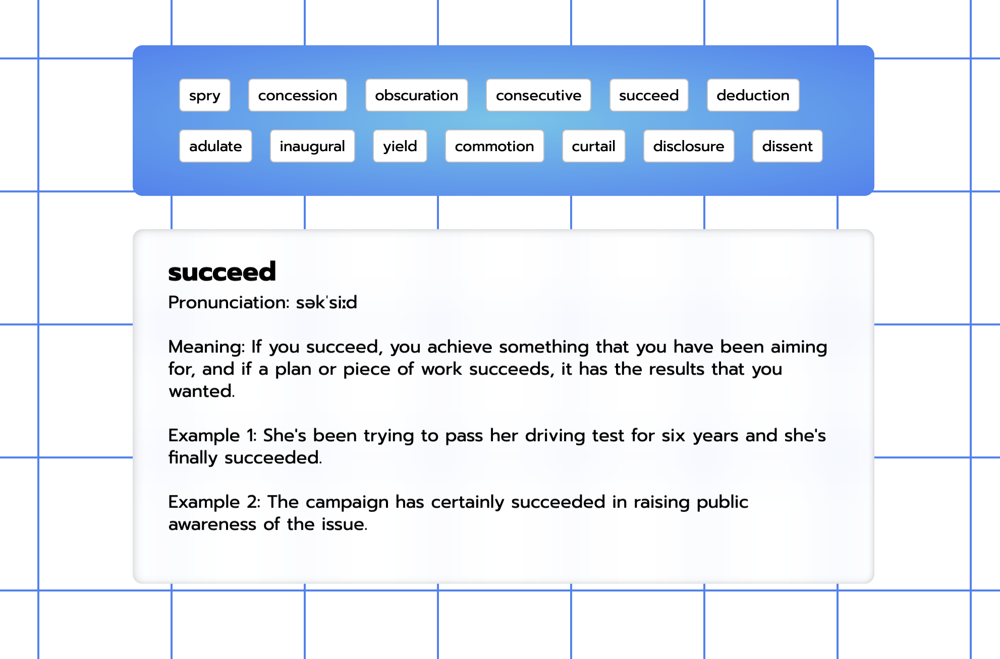

# Details Switcher

Application shows a card with details and further explanations.
Written with node.js, express, bodyParser and ejs.


## Installation

1. Clone the repository:
   ```bash
   git clone https://github.com/tpreisig/word-switch.git
   ```
2. Navigate to the project directory:
   ```bash
   cd word-switch
   ```
3. Install dependencies:
   ```bash
   npm install
   ```

## Usage

To start the project, run:
```bash
npm start
```

## License

This project is licensed under the MIT License - see the [LICENSE](LICENSE) file for details.


## Screenshots



## Contact

Maintained by tpreisig - feel free to reach out!